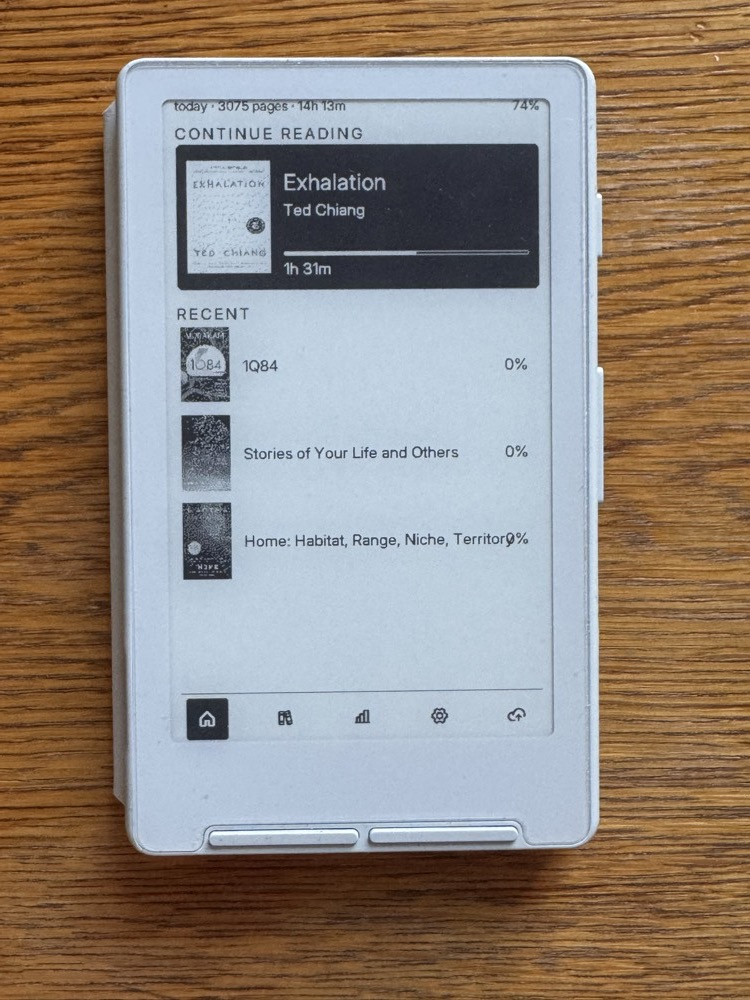
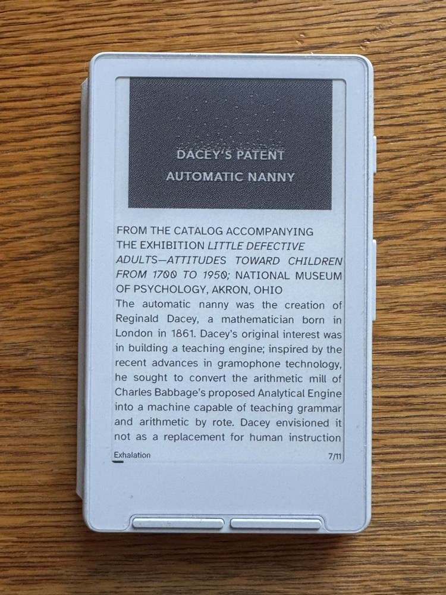
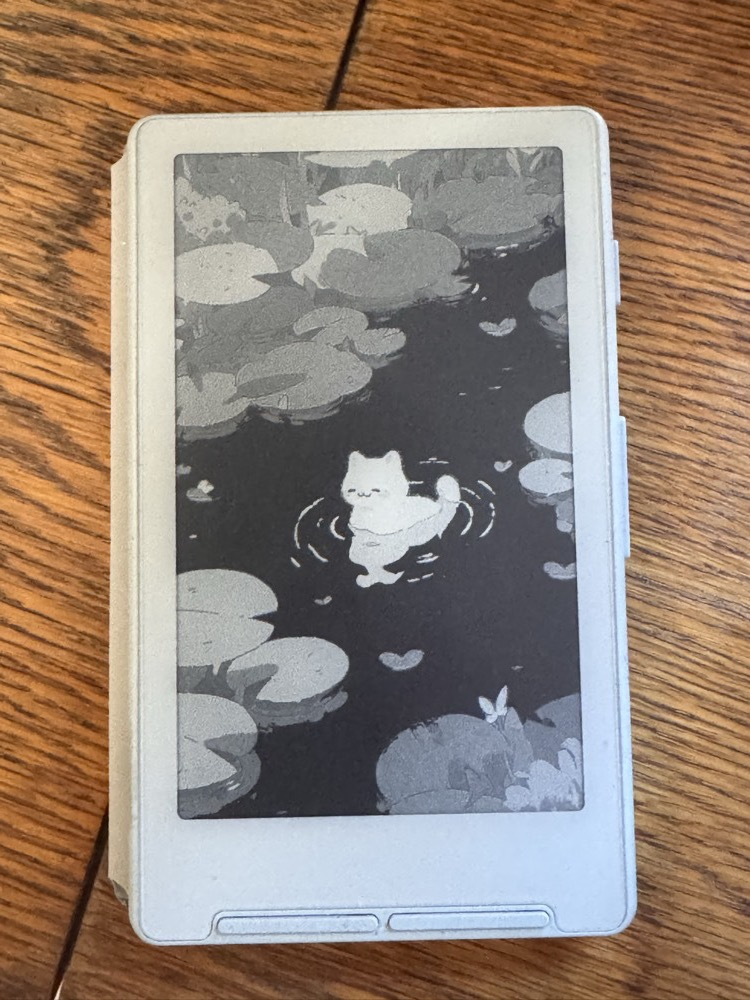

# plump

Bare-metal e-reader firmware for the [XTEink X4](https://github.com/xteink), built in Rust; `#![no_std]`, no framebuffer, no `dyn` dispatch, async via Embassy on esp-rtos. Based on [hansmrtn/pulp-os](https://github.com/hansmrtn/pulp-os).

It's roughly split into a kernel (`kernel/`: drivers, scheduler, storage, EPD rendering) and a distro (`src/`: apps, fonts, UI). The kernel has zero imports from the app layer, so it could be forked for another device.

## Screens

| Home | Reader | Sleep |
|---|---|---|
|  |  |  |

## Features

- **Reader**: EPUB (ZIP/OPF/HTML pipeline, chapter cache on SD, TOC, inline PNG/JPEG dithered to 1-bit) and plain `.txt`, with bold/italic/heading styles and configurable margins, line spacing and alignment. Justification runs a real Knuth-Plass breaker: whole-paragraph dynamic programming over legal breakpoints with badness, fitness classes and soft-hyphen breaks, in i32 fixed point with no allocator beyond the output vec. Progressive JPEGs decode too, band by band, so covers written that way aren't just a grey box
- **Home**: continue-reading card plus recent books
- **Stats**: WIP
- **WiFi upload**: HTTP server + mDNS at `http://plump.local/`, drag-and-drop web UI, QR code on device. Falls back to bringing up its own hotspot (`PLUMP-X4`) when no configured network is in range
- **Bookmarks**: 16-slot LRU in RAM, flushed to SD every 30 s and on sleep
- **Display**: ~400 ms partial page turns, periodic full clear to kill ghosting, sunlight mode

## Build

Needs stable Rust ≥ 1.88 (`rust-toolchain.toml` pulls in `riscv32imc-unknown-none-elf`), [`espflash`](https://github.com/esp-rs/espflash), and a sibling checkout of [`timcki/smol-epub`](https://github.com/timcki/smol-epub) (a fork of [`hansmrtn/smol-epub`](https://github.com/hansmrtn/smol-epub) carrying the progressive-JPEG work).

```sh
cargo run --release   # build, flash over USB, open the serial monitor
```

## Controls

| | |
|---|---|
| Prev / Next | scroll or turn page |
| Prev / Next jump | page skip; chapter skip in the reader |
| Select | open |
| Back | go back; long-press for home |
| Power short | quick-action menu |
| Power long | deep sleep |

## Layout

```
kernel/src/  kernel, board support, drivers, no-alloc UI primitives
src/         apps (home, library, reader, stats, settings, upload), fonts, chrome
ld/          vendored linker chain: pinned stack + one contiguous heap
assets/      TTF fonts, upload web UI
build.rs     fontdue TTF rasterisation at compile time
```

Architecture notes on strip rendering, the 3-phase refresh, SPI arbitration and the app trait live in [AGENTS.md](AGENTS.md).

## License

MIT, see [LICENSE](LICENSE).
